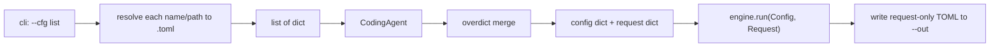

# Multi `--cfg` merge via overdict

## Goal

User runs layers like:

```bash
uzcode --workdir . --cfg base --cfg local --cfg ./my_request.toml --out result.toml
```

CLI only resolves/loads TOML paths into a **list of dicts**. `CodingAgent` merges them with **overdict**, splits config vs `[request]`, runs the engine, and writes **request-only** output.

## Current → target

| Today | Target |
|-------|--------|
| Fixed `{workdir}/.uzcode/cfg.toml` | Multiple `--cfg` layers merged by overdict |
| Separate `--req` (`[[messages]]` top-level) | Request lives under `[request]` (e.g. `[[req.messages]]`) |
| `--out` defaults to overwrite `--req` | `--out` or auto `./output_<timestamp>.toml` |
| No backup | Existing `--out` file → `.uzcode/outbak/<name>.<ts>.toml` then write |
| `CodingAgent.run` stub loads files itself | Agent receives cfg dict list, merges, separates request |

Keep existing `Config` / `Request` / `engine.run` shapes as much as possible; change how they are **constructed and written**, not the LangGraph loop.

## Architecture



## CLI changes — [`src/uzcode/cli.py`](src/uzcode/cli.py)

- **Add** `--cfg` (`nargs="+"`): ordered list of cfg tokens.
- **Remove** `--req`.
- **Keep** `--workdir` (project root / `work_dir`).
- **Change** `--out`: default `None` → auto `./output_<YYYYMMDD_HHMMSS>.toml` (cwd-relative unless absolute); if set, use that path.
- Flow: resolve+load `--cfg` → `CodingAgent(...).run(cfg_dicts, out_path=...)` (or thin wrapper that still calls `load_extensions` + `engine.run` after agent returns config/request — prefer one place: agent owns merge+split+run+write).

Keep helpers minimal: one resolve function, one load-to-dict loop in CLI (or a tiny module function), no resolver class hierarchy.

## `--cfg` resolution (name only; `.toml` optional)

For each token, strip a trailing `.toml` if present, then resolve against `work_dir`:

1. **User path**: if the token looks like / is an existing file path (absolute, or relative to cwd / workdir) → that file.
2. **Project cfg**: `{work_dir}/.uzcode/cfgs/{name}.toml` if present.
3. **Built-in**: package data `uzcode/cfgs/{name}.toml` (ship `base.toml`, `dev.toml` under [`src/uzcode/cfgs/`](src/uzcode/cfgs/)).

Fail with a clear error if none match. Later `--cfg` entries overlay earlier ones via overdict (user’s merge order: base → dev → request).

## Merge + split — [`src/uzcode/__init__.py`](src/uzcode/__init__.py) `CodingAgent`

Prefer thin procedural API (your constraint: few classes/functions):

```python
# conceptual
merged = overdict.merge(cfg_dicts)  # exact overdict call per your lib API
req_raw = merged.pop("request", {})  # or extract without mutating if overdict needs full dict
config = Config.from_dict(work_dir, merged)   # llm/loop/tools/extension/...
request = Request.from_dict(out_path, work_dir, req_raw)
```

- Add `Config.from_dict` / `Request.from_dict` (or extend loaders to accept an already-parsed dict) in [`config.py`](src/uzcode/data/config.py) / [`request.py`](src/uzcode/data/request.py).
- Deprecate / stop requiring `Config.load(work_dir)` fixed `cfg.toml` path for the main path (keep load only if useful for tests, or rewrite it as “load one file → from_dict”).
- Messages move from top-level `messages` to `request.messages` in TOML; `Request` still holds `list[Message]` in memory.
- `Request.write` writes **only the request document** (same shape as input request layer: under `request` key so reloads via `--cfg` stay consistent), **not** llm/tools/extension.

Exact overdict import/call follows your local package API (add dependency in [`pyproject.toml`](pyproject.toml) to your published/local `overdict` / `py-overdict` — you specify install name when implementing).

## Output + backup

Before write:

1. Resolve `out_path` (`--out` or `output_<timestamp>.toml`).
2. If `out_path` exists as a file:
   - `mkdir` `{work_dir}/.uzcode/outbak/`
   - copy/rename existing file to `{work_dir}/.uzcode/outbak/{original_basename}.{replace_timestamp}.toml`
3. Write request-only TOML to `out_path`.

Move write/backup next to `Request.write` or a small `write_out(path, request, work_dir)` helper used by agent/engine so `engine.run` does not keep assuming “overwrite req file with full messages-only doc” without backup. Prefer: engine still updates `request.messages`; agent (or write helper) owns backup + path.

## TOML shape (examples)

Config layer (`base` / `.uzcode/cfgs/local.toml`): unchanged sections — `[llm]`, `[loop]`, `[tools.*]`, `[extension]`, …

Request layer:

```toml
[request]
# optional future keys

[[req.messages]]
role = "user"
content = "..."
```

After run, `--out` contains only the `request` tree (updated messages), not merged config keys.

## Files to touch

- [`src/uzcode/cli.py`](src/uzcode/cli.py) — argparse + load dict list + out default
- [`src/uzcode/__init__.py`](src/uzcode/__init__.py) — `CodingAgent.run(cfg_dicts, out_path=...)`
- [`src/uzcode/data/config.py`](src/uzcode/data/config.py) — `from_dict`; drop hard dependency on `.uzcode/cfg.toml` for main path
- [`src/uzcode/data/request.py`](src/uzcode/data/request.py) — `from_dict` for `request` section; write request-only; optional outbak helper
- [`src/uzcode/engine.py`](src/uzcode/engine.py) — only if write path/backup needs to leave engine
- [`pyproject.toml`](pyproject.toml) — add overdict dependency; ensure `uzcode/cfgs/*.toml` packaged
- New [`src/uzcode/cfgs/base.toml`](src/uzcode/cfgs/base.toml), [`dev.toml`](src/uzcode/cfgs/dev.toml) — extract sensible defaults from current example `cfg.toml`s
- Update [`examples/*/`](examples/) to use `.uzcode/cfgs/` + request-under-`[request]` and sample CLI with `--cfg`

## Non-goals / keep simple

- No multi-class resolver hierarchy, no Plugin/Loader framework for cfgs
- No keeping `--req` dual path unless you later ask for compat
- Engine loop, tools, extensions unchanged once they receive `Config` + `Request`
