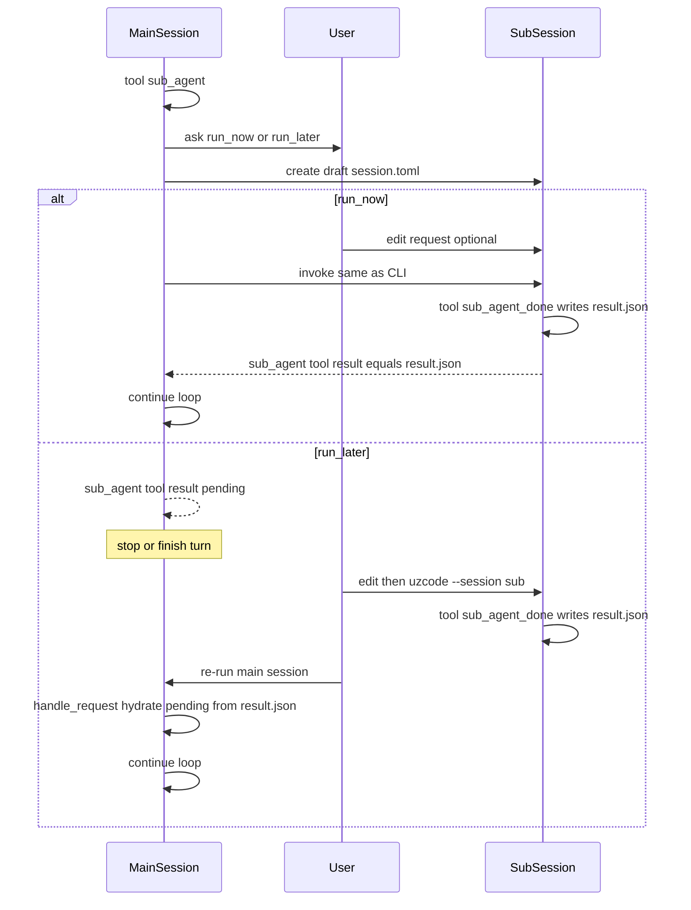

# Sub-agent extension

## Locked design

- Sub-agent is **another normal session** (own `session.toml` / `bak/` / `diff/`), not a hidden in-process nested brain.
- Main proposes via tool `sub_agent`; sub **actively** finishes via tool `sub_agent_done` writing `result.json`.
- **Do not** use last assistant message as the result.
- **No** session status field. Pending vs done = main `sub_agent` tool-result body + whether `result.json` exists.
- **run-now**: after user approve (+ optional edit), run sub like CLI; `sub_agent` returns result payload naturally.
- **run-later**: `sub_agent` returns `pending` (+ `sub_session`); later main re-run hydrates that tool message from `result.json` and clears `pending`.

## Goals / non-goals

- Goals: user-controlled sub requests; replay/fork; thin core; explicit `result.json`.
- Non-goals (v1): parallel fan-out UI, depth policy engine, last-assistant-as-result, session `status`, nested Python without session files, new markdown design docs.

## Placement

- Built-in extension [src/extensions/sub_agent/](src/extensions/sub_agent/) (same pattern as [src/extensions/task_summary/](src/extensions/task_summary/)).
- Hooks: `handle_request` (hydrate pending); tools `sub_agent` / `sub_agent_done`; custom `ask` on `sub_agent`.
- Core ([src/uzcode/engine.py](src/uzcode/engine.py), [src/uzcode/cli.py](src/uzcode/cli.py)) stays thin; run-now reuses prepare → run → `copy_session_to_bak` / `persist_session` ([src/uzcode/data/request.py](src/uzcode/data/request.py)).

## Tools

### `sub_agent` (main)

- Args: `prompt` (required), optional `session` name (default generated).
- Steps:
  1. Create `.uzcode/sessions//session.toml` with draft `[req].messages` (user prompt).
  2. `ask`: run-now / run-later / deny.
  3. **run-later** → tool result `{"status":"pending","sub_session":"<name>"}`.
  4. **run-now** → allow user edit, run sub with same cfg layers as parent, read `/result.json`; tool result = file contents (or error if missing after sub exit).

### `sub_agent_done` (sub)

- Writes **`result.json`** under current session dir (`request.path.parent`, same idea as llm_sent).
- Tool description: sub **must** call this to hand back a delegated task.

## Pending hydration (run-later)

On main `handle_request` (before LLM):

1. Scan tool messages with pending `sub_agent` payload (`status` + `sub_session`).
2. If `/result.json` exists → replace tool message content with file contents (pending gone).
3. If still pending → do not invent a result; stop before LLM with a clear message.
4. Normal CLI bak/diff/session write persists hydrated messages after the run.

No session status file.

## Cfg

- Enable via `[extension] enable` including `sub_agent`.
- `[tools.sub_agent]` / `[tools.sub_agent_done]` permissions as usual (default `ask`).
- v1: ask-only for run mode; no extra `[exts.sub_agent]` knobs required.

## Defaults

- Result artifact: `result.json` only.
- Result authorship: `sub_agent_done` only.
- Orchestration marker: pending JSON in main tool result only.
- Nesting: another normal session only; no depth counter in core.
