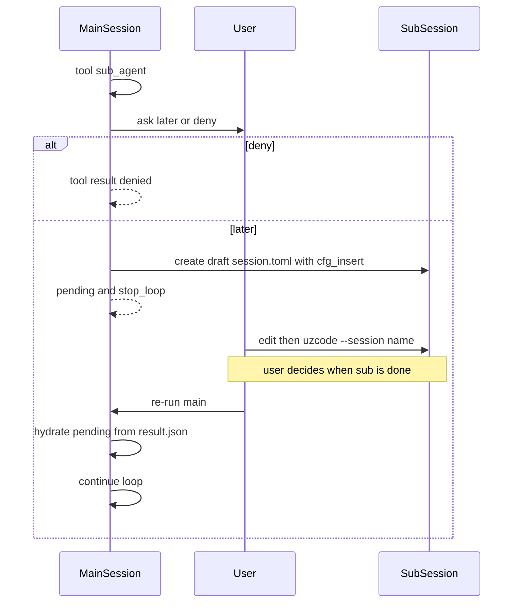

# Sub-agent 功能實作計畫

本文件依 [idea_begin.md](./idea_begin.md) 的「使用者主導／session 可手改／可 replay」原則，拆出 **Sub-agent** 的專項開發計畫。  
前置：薄引擎、extension、tools、`auto_loop`、sessions（`session.toml` / `bak/` / `diff/`）已完成。

**核心原則**：Keep it simple, give control to the user.

**分層原則（重要）**：

| 層級 | 內容 | 權威來源 |
|------|------|----------|
| **Sub session** | 與 main 相同的 session 目錄語意（`session.toml`、`bak/`、`diff/`） | 既有 sessions 機制 |
| **交接產物** | 子 agent **主動**寫入的 `result.json` | 本專項（`sub_agent_done` tool） |
| **主 session 暫停標記** | `sub_agent` tool result 內的 `pending` | 本專項（**不**另建 session status） |
| **uzcode 執行層** | extension 註冊 tools／`handle_request` hydrate；使用者以既有 CLI 跑子 session | 本專項；核心引擎保持極薄 |

Sub-agent **不是** Python 內嵌巢狀腦：主 agent 只**提案**一份可手改的 request／session，使用者核准後以**一般 uzcode 執行**跑子 session；結果經 `result.json` 回到主 session 的 tool result。不在主行程內 in-process 跑子 session（不做 run-now）：巢狀執行對 `sub_agent_done` 不穩定，是否完成由使用者判斷。

---

## 1. 目標

| 目標 | 含義 |
|------|------|
| Session 組合 | 子任務 = 另一個正常 session，自有 bak／diff／可手改 request |
| 使用者閘門 | `sub_agent` 建立草稿後詢問 run-later／deny；可先改 `session.toml` 再跑 |
| 主動交接 | 子 agent **必須** tool call `sub_agent_done` 寫 `result.json`；**不用**最後一則 assistant 訊息當結果 |
| Pending 可恢復 | 主 tool result 為 `pending`；之後重跑 main 時若存在 `result.json` 則 hydrate 進該 tool result 並去掉 pending |
| 使用者判定完成 | 使用者自行跑子 session、檢查結果，確認完成後才重跑 main |
| 薄核心 | 邏輯放在 built-in extension；引擎不新增「子 agent 執行節點」 |
| Replay 友好 | 提案、pending、hydrate 後內容皆落在可手改的 messages／檔案上 |

---

## 2. 非目標（本階段明確不做）

- 以「最後一則 assistant message」或被動掃 transcript 當子結果
- Session 層級 `status` 欄位（完成與否只看 `sub_agent` tool result + `result.json` 是否存在）
- 隱藏的 in-process 巢狀 agent（不寫 session 檔、無使用者閘門）
- **run-now**：主行程內 prepare→run→persist 子 session（巢狀呼叫 `sub_agent_done` 不穩定）
- v1 平行 fan-out UI／排程器
- 核心內建 nesting depth 限制或特殊權限圖
- 把 sub-agent 做成獨立 CLI 子命令（仍用既有 `uzcode --session …`；`--cfg` 可省略）

---

## 3. 運作模型

```text
Main session
  │
  ├─ LLM tool_calls: sub_agent(prompt, session?)
  │     → ask：run-later | deny
  │     → （later）建立 .uzcode/sessions/<sub>/session.toml
  │        （cfg_insert = [*main --cfg tokens, "subagent"] + [req] 草稿）
  │
  ├─ deny
  │     → 既有 deny tool result；不建 session
  │
  ├─ run-later
  │     → tool result = {"status":"pending","sub_session":"<name>"}
  │     → 本輪結束；使用者稍後手跑子 session
  │
  └─ 使用者重跑 main
        → handle_request：若 tool result 仍為 pending
              且 <sub>/result.json 存在 → 寫入 tool result，去掉 pending
              否則 → 不捏造結果；停止進 LLM，提示先跑子 session
```



### 3.1 為什麼不用 session status

「子任務是否完成」對主 agent 而言就是：**這次 `sub_agent` tool call 的 result 是什麼**。

- 已完成（已 hydrate）：result 為 `result.json` 內容
- 未完成：result 為 `pending`（含 `sub_session`）
- 重跑 main 時只認 pending + 磁碟上的 `result.json`，不另維護 status 檔或 session 欄位
- 使用者決定何時視為完成：確認子 session 與 `result.json` 後才重跑 main

### 3.2 為什麼結果必須是 tool 寫出的 `result.json`

最後一則 assistant 訊息是被動產物，主 agent／hydrate 難以穩定判斷「這就是正式交接」。  
強制 `sub_agent_done` 讓子 LLM **主動**產出結構化交接，準確度與可驗證性較高。使用者也可手改 `result.json` 再重跑 main。

### 3.3 為什麼不做 run-now

主行程內巢狀 `CodingAgent.prepare` → `run` 時，子 session 常無法穩定呼叫 `sub_agent_done` 或寫出正確結果。改為只建草稿 + pending，由使用者用既有 CLI 跑子 session，自行判斷是否完成。

---

## 4. Tools

### 4.1 `sub_agent`（於 **main** session 呼叫）

| 項目 | 說明 |
|------|------|
| 參數 | `prompt`（string，必填）；`session`（可選，子 session 名；省略則產生唯一名） |
| 副作用 | 建立 `{work_dir}/.uzcode/sessions/<sub>/session.toml` 草稿：`cfg_insert`（預設 main `--cfg` tokens + `subagent`）與 `[req].messages` |
| 權限 | 走既有 `tools.sub_agent.permission`；另以 tool `ask` 詢問 **run-later／deny** |
| run-later 回傳 | JSON：`{"status":"pending","sub_session":"<name>"}`（路徑由既有 `resolve_session_dir` 推導）；設 `stop_loop` |
| deny | 既有 deny tool result；不建立 session |

核准 later 後印出使用者可跑的 CLI（`--cfg` 可省略；stack 來自 session.toml 的 `cfg_insert`）：

```text
uzcode --workdir <work> --session <name>
```

Main `--cfg` tokens 來自 `PrepareMeta.cfg_raw_inputs`，經 `ctx["preparemeta"]` 給 extension（**不**寫入 main `session.toml` path）。`[exts.sub_agent] cfg_insert` 可整份覆寫。

### 4.2 `sub_agent_done`（於 **sub** session 呼叫）

| 項目 | 說明 |
|------|------|
| 參數 | 至少 `summary`（string）；可擴充結構化欄位（實作時定 schema） |
| 副作用 | 寫入**目前** session 目錄下的 `result.json`（以 `request.path.parent` 解析 session dir，同 llm_sent 慣例） |
| 語意 | 子任務正式交接；tool description 應要求委派任務結束前必須呼叫 |
| 回傳 | 確認已寫入（路徑對 LLM 用 workdir 相對路徑，避免絕對路徑外洩） |

**本階段唯一認可的子結果來源**：`result.json`（由本 tool 寫入，或使用者手改後再 hydrate）。

---

## 5. Pending hydrate（run-later）

掛在 extension 的 **`handle_request`**（進 LLM 之前）：

1. 掃描 messages 中 `role=tool` 且內容可解析為 `sub_agent` 的 pending payload（`status == "pending"` 且有 `sub_session`）。
2. 若 `{sessions/<sub>/result.json}` 存在：將該 tool message 的 `content` **整段取代**為檔案內容（字串；若為 JSON 則可 `json.dumps` 保持穩定）→ pending 消失。
3. 若仍有未解析的 pending：**不**捏造結果；設 `stop_loop`（或等價中止），CLI／日誌提示使用者先跑子 session。
4. Hydrate 後的 messages 隨本次 run 結束走既有 CLI persist（bak／diff／session.toml）。

識別 pending **只**靠主 session 裡該次 `sub_agent` tool result 本文，**不**讀 session status。

---

## 6. Cfg 與權限

```toml
[extension]
enable = ["sub_agent", ...]   # 或省略 = 載入全部內建／專案 exts

[tools.sub_agent]
# permission = "ask"   # 預設 ask；ask callback 選 run-later / deny

[tools.sub_agent_done]
# permission = "ask"

# 可選：整份覆寫子 session 的 cfg_insert（預設為 main --cfg + "subagent"）
# [exts.sub_agent]
# cfg_insert = ["base", "subagent"]
```

使用者閘門以 ask 為準；`permission = "approve"` 時視為 later（建草稿 + pending）。

`--cfg` 可省略：若省略，`session.toml`（含 `cfg_insert`）即為整個 stack。

---

## 7. 檔案配置（實作時）

| 路徑 | 職責 |
|------|------|
| `src/extensions/sub_agent/__init__.py` | `register`：tools + `handle_request` hydrate |
| `src/extensions/sub_agent/handlers.py` | 建 session、讀寫 `result.json`、pending 解析 |
| 既有 `src/uzcode/cfg.py` `PrepareMeta.cfg_raw_inputs` / `resolve_session_dir` | CLI tokens 與子 session 路徑 |
| 既有 `src/uzcode/engine.py` `_mk_ctx` | `ctx["preparemeta"]` |
| 既有 `src/uzcode/data/session.py` | bak／persist（使用者以 CLI 跑子 session 時走既有路徑） |
| 既有 `src/uzcode/cli.py` / `CodingAgent` | 使用者跑子：`uzcode --session …`（`--cfg` 可省略） |
| `src/uzcode/cfgs/subagent.toml` | 啟用 `sub_agent_done` |
| `examples/…`（實作階段） | main + sub 示範 |

核心 [engine.py](../src/uzcode/engine.py) **不**新增 sub-agent 專用 node。

---

## 8. 邊界與錯誤

| 情況 | 行為 |
|------|------|
| 使用者 deny `sub_agent` | 一般 tool deny result |
| 重跑 main、仍無 `result.json` | 保持 pending；不進 LLM（或進 LLM 前 stop）並提示 |
| `result.json` 存在但 JSON 損壞 | hydrate 失敗 → 明確 error／保持 pending，不吞錯 |
| 多個 pending | 逐一依 `sub_session` hydrate；任一未完成則整體不繼續 LLM |
| 子再呼叫 `sub_agent` | 允許：只是再建另一個正常 session（v1 不做 depth 計數） |

---

## 9. 實作順序（摘要）

```text
1. 文件（本檔）
2. extension 骨架：註冊 sub_agent / sub_agent_done
3. 建立草稿 session.toml + ask later/deny
4. sub_agent_done → result.json
5. handle_request pending hydrate + 未完成則 stop
6. example + 測試（pending → 寫 result → 重跑 main → content 已取代）
```

### 建議測試點

- 建立子 session 草稿後 `session.toml` 含 `cfg_insert`，可手改再跑
- 預設 `cfg_insert` = main `--cfg` tokens + `subagent`（已含則不重複）
- `sub_agent` 一律回 pending 並設 `stop_loop`（不巢狀跑子）
- run-later：main tool result 為 pending；寫入 `result.json` 後再 prepare／hydrate，tool content 已非 pending
- 子未寫 `result.json`：重跑 main 仍 stop

---

## 10. 與理念對照

| idea_begin | 本設計 |
|------------|--------|
| Stateless／完整 session | 子任務也是完整 session 檔 |
| 使用者可手改 request | 跑前改子 `session.toml` |
| 進階行為靠 extension | `sub_agent` ext，不肥核心 |
| Debug／fork／replay | pending、result、messages 皆可重放 |
| 不隱藏狀態 | 無平行的 session status；真相在 tool result + `result.json` |
| 使用者主導 | 不巢狀執行；使用者決定何時跑子、何時視為完成 |

---

**文件狀態**：設計定稿（run-later only）  
**核心原則**：Keep it simple, give control to the user.
